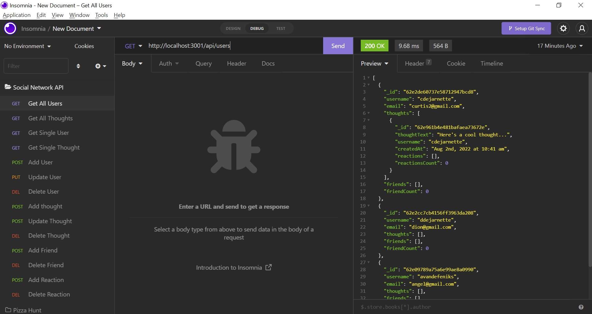

# The Tech Blog
 

## Description
This is a backend for a social network application. It allows for the retrieval of a list of users and a single user. It allows for the creation of a user, the update of a user and deletion of a user. Users are able to add friends to their accounts. These friends are listed when ever a user or a list of users is retrieved. Users are able to view, post, edit and delete thoughts which are associated with each user. The backend also allows for the retrieval of all thoughts and a single thought. Users are able to post and delete reactions to thoughts. These reactions are listed when thoughts or a single thought are retrieved.  

## Technologies Used
* Node.js
* Express.js
* MongoDB
* Mongoose

### Dployed Application
[https://drive.google.com/file/d/1xjhQvPvfg8ytJm3s9-R1z8IqJ3-ygpnC/view](https://drive.google.com/file/d/1xjhQvPvfg8ytJm3s9-R1z8IqJ3-ygpnC/view)

### Created by
Angel Van de Feniks
